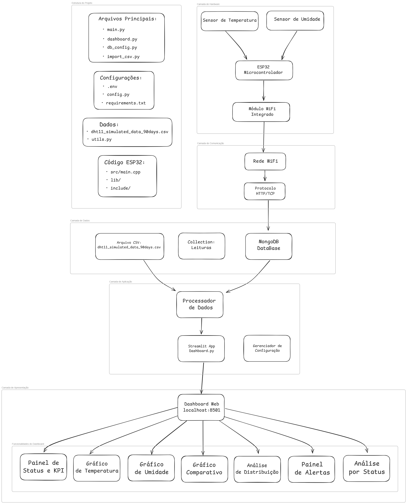

# Sistema de Monitoramento ESP32 - Temperatura e Umidade

Dashboard em tempo real para monitoramento de temperatura e umidade usando ESP32, MongoDB e Streamlit.

## Arquitetura do Sistema



## Pré-requisitos

- Python 3.8+
- MongoDB Community Server
- Git (para clonar o repositório)

## Como executar o projeto

### 1. Clone o repositório

```bash
git clone <url-do-seu-repositorio>
cd projeto-esp32-temperatura
```

### 2. Instale o MongoDB

- **Windows**: Baixe e instale o MongoDB Community Server (https://www.mongodb.com/try/download/community)
  - Durante a instalação: Marque a opção "Install MongoDB as a Service"
  - Verifique se está rodando: Abra o "MongoDB Compass" ou verifique nos serviços do Windows

### 3. Instale as dependências Python

```bash
cd backend/
pip install -r requirements.txt
```

### 4. Configure o arquivo .env

Crie um arquivo `.env` na pasta `backend/` com o seguinte conteúdo:

```env
# Configurações do MongoDB
MONGO_URI=mongodb://localhost:27017/
MONGO_DB=temperatura_db
MONGO_COLLECTION=leituras

# Configurações da API Flask
FLASK_HOST=0.0.0.0
FLASK_PORT=5000
FLASK_ENV=development
FLASK_DEBUG=True
SECRET_KEY=sua-chave-secreta-super-forte-aqui-mude-isso

# API Key (opcional)
API_KEY=SUA_API_KEY_SECRETA_AQUI_SE_FOR_PROTEGER_O_POST

# Limites dos sensores
TEMP_MIN_ALERTA=5
TEMP_MAX_ALERTA=30
TEMP_MIN_CRITICO=0
TEMP_MAX_CRITICO=40

UMID_MIN_ALERTA=20
UMID_MAX_ALERTA=90
UMID_MIN_CRITICO=10
UMID_MAX_CRITICO=95
```

### 5. Execute o sistema

**Opção 1: Executar tudo junto (recomendado)**

```bash
# Na pasta backend/
python main.py
```

- A API estará rodando em: `http://localhost:5000`

Em outro terminal:

```bash
# Na pasta backend/
streamlit run dashboard.py
```

- O dashboard estará em: `http://localhost:8501`

### 6. Teste o sistema

Teste a API manualmente:

```bash
# Enviar dados de teste
curl -X POST http://localhost:5000/data \
  -H "Content-Type: application/json" \
  -d '{"temperatura": 25.5, "umidade": 60.2}'
```

Ou acesse:

- Dashboard: `http://localhost:8501`
- API: `http://localhost:5000`

### 7. Importar dados históricos (opcional)

Se você tem dados em CSV para testar:

```bash
# Na pasta backend/
python import_csv.py seu_arquivo.csv
```

## Configuração do ESP32

No código do seu ESP32, configure:

```cpp
// Substitua pelo IP da sua máquina
const char* servidor = "http://192.168.1.100:5000/data";
```

Para descobrir seu IP:

- Windows: `ipconfig` no CMD
- Linux/Mac: `ifconfig` no terminal

## Estrutura do Projeto

```
PROJETO-ESP32-TEMPERATURA/
├── backend/
│   ├── main.py              # API Flask
│   ├── dashboard.py         # Dashboard Streamlit
│   ├── config.py           # Configurações
│   ├── db_config.py        # Config MongoDB
│   ├── import_csv.py       # Importar dados
│   ├── utils.py            # Utilitários
│   ├── requirements.txt    # Dependências
│   ├── .env               # Variáveis de ambiente
│   └── dht11_simulated_data_90days.csv
├── esp32/
│   ├── src/main.cpp       # Código ESP32
│   ├── platformio.ini     # Config PlatformIO
│   └── ...
└── README.md
```

## Problemas Comuns

**MongoDB não conecta**

```bash
# Verifique se o MongoDB está rodando
# Windows: Abra "Serviços" e procure por "MongoDB"
# Ou tente reinstalar o MongoDB Community Server
```

**Erro de dependências Python**

```bash
# Tente atualizar o pip
python -m pip install --upgrade pip
pip install -r requirements.txt
```

**Dashboard não carrega**

```bash
# Certifique-se que a API está rodando primeiro
# Verifique se não há conflito de portas
```

## Como usar

1. Inicie a API e Dashboard seguindo os passos acima
2. Configure seu ESP32 com o IP correto
3. Acesse o dashboard em `http://localhost:8501`
4. Monitore os dados em tempo real
5. Configure alertas editando os limites no `.env`

## API Endpoints

- `POST /data` - Recebe dados dos sensores
- `GET /health` - Status da API
- `GET /latest` - Últimas leituras

## Tecnologias

- **Hardware**: ESP32, DHT11/DHT22
- **Backend**: Python, Flask, MongoDB
- **Frontend**: Streamlit
- **Comunicação**: HTTP/WiFi
